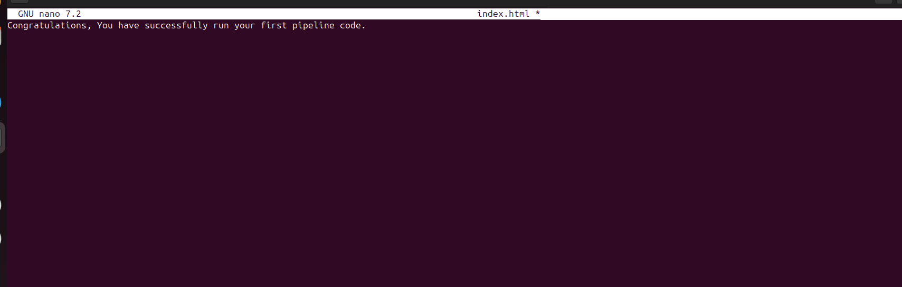

# Jenkins_Pipeline_Job 
A Jenkins Pipeline job is a specialized type of job in Jenkins that allows you to define your entire software delivery process (build, test, deploy, etc.) as code. Instead of configuring jobs step by step in the Jenkins UI, you write a Jenkinsfile (a text file, usually stored in your source code repository) that describes the stages and steps of your pipeline.

Key Points:
- Pipeline as Code: Everything (build, test, deploy, notifications, etc.) is written in Groovy-based DSL (Domain-Specific Language).

- Stages & Steps: A pipeline is divided into stages (e.g., "Build", "Test", "Deploy") and steps (individual tasks like running a command, checking out code, or publishing artifacts).

- Version Control: Since the pipeline is stored in a Jenkinsfile, it can be versioned alongside your source code.

- Automation: Enables Continuous Integration (CI) and Continuous Delivery/Deployment (CD).

## Types:
1. Declarative Pipeline – A simpler, structured syntax (most commonly used).

2. Scripted Pipeline – More flexible, uses full Groovy scripting.

## Creating  A Pipeline job 
Lets create a pipeline our first pipeline jobe 
1. from the dashboard menu on the left side , click on new item.

.

2. Create a pipeline job and name it "My pipeline jobe"

.

## Configuring Build Trigger.
Like we did previously in the earlier project, create a build trigger for jenkins to trigger new build
1. Click "Configure" your job and add this configurations

2. Click on build trigger to configure triggering the job from GitHub webhook"

.

3. since we have created a github webhook previously, we do not need to create another one again . now lets work on our pipeline 

## Writting Jenkins Pipeline Script
A Jenkins Pipeline script is the code that tells Jenkins how to build, test, and deploy your project.

Instead of manually configuring steps in the Jenkins UI (like in freestyle jobs), you write a Groovy-based script — usually stored in a file called Jenkinsfile inside your repository.

Lets write our pipeline script

.

# Explanation of the script above
The provided jenkins pipeline scripts defines a series of stages for a CI/CD Process . lets break down each :

- Agent Configuration 

This specifies that the pipeline can run on any available agent( an agent can either be a jenkins master or node). This means the pipeline is not tied to a specific node type.

- Stage: 
.

defines the various stage of the pipeline , each representing a phase in the software delevery process . 

- Stage 1. connect to Github:
.

- This stage checks out the source code from a Github repository.

It specfies that pipeline should use the 'main' branch.

- Stage 2 Build Dcker Image

.

- This stage build dcker image named dockerfile using the source code obtained from Github repository

- The docker build command is executed using the shell (sh).

- Stage 3 Run Docker Container

.

This stage run docker container named 'nginx' in detached mode ( -itd)

- The container is mapped to port 8081 on the host machine ( -p 8081 : 80)

- TH=he docker image used is the one built in the previous stage ( dockerfile ).

# Copy The pipeline script and Paste it here 

.

The stage 1 of the script connect jenkins t github repository . To genrate syntax for your Github repository , follow this steps:

1. click on the pipeline syntax

.

2. Select the drop down to search for 'checkout : checkout from version control'

.

3. Paste Your repository url and make sure your branch is main.

.

4. Generate your pipeline script

.

Now you can replace the generated script for cennect jenkins with github

## Installing Docker

Before jenkins can run docker commands, we need to install docker on the same instance jenkins was installed. From our shell scripting knowledge, let's install docker with shell script

1. Create a file named docker.sh

2. Open the file and paste the script below"

.

3. Make it executable
.

4. Run it 
.

.

## Building Pipeline Script
Now that we have docker installed on the same instance with jenkins, we need to create a dockerfile before we can run our pipeline script. As we know, we cannot build a docker image without a dockerfile. Let's recall the dockerfile we used to build a docker image in our docker foundations. In the main branch on jenkins-scm,
1. Create a new file named dockerfile

.

2. Paste the code snippet below in the file
.

3. create an index.html file and paste this content.

.

.

pushing these files 'dockerfile and index.html' will trigger jenkins t automatically run ne build for ur pipeline.

4. Commit and push TO Github
git add Dockerfile index.html
git commit -m "Added Dockerfile and index.html for Jenkins pipeline"
git push origin main

.

To access the content of index.html on our web browser, you need to first edit inbound rules and open the port we mapped our container to (8081) or run this 'sudo ufw allow 8081/tcp' in your local machine Vm.

.
 
 We can now access the content of indext.html on our web browser.

 .

 
